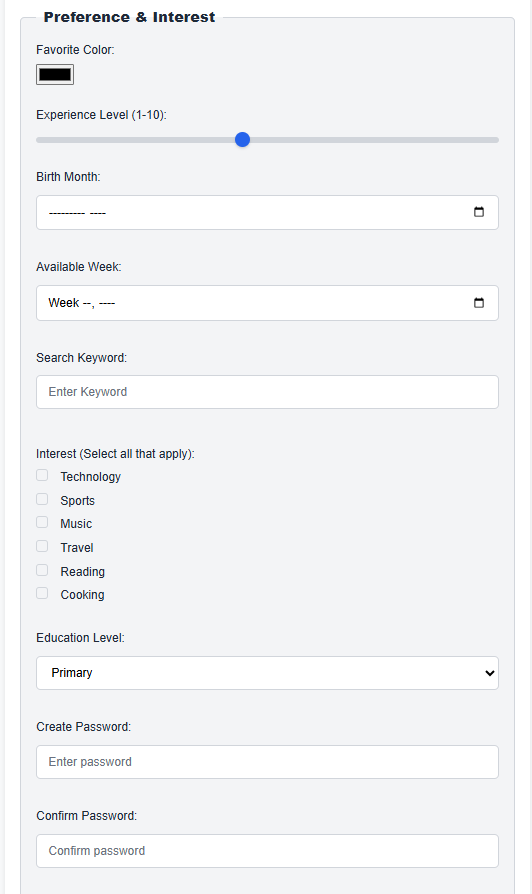

# Form Implementation Project

## Description
This project contains a semantic HTML form based on provided specifications, demonstrating best practices in HTML structure and accessibility.

## Purpose
The form collects user information such as personal details, contact info, and preferences, organized into logical sections.

## File Structure
- `index.html`: Contains the complete, semantic HTML form.
- `README.md`: Documentation about the project.

## Implementation Approach
The form uses semantic tags (`<form>`, `<fieldset>`, `<legend>`, `<label>`, `<input>`, `<textarea>`, `<select>`) to structure data logically and accessibly. Proper labeling and input types ensure usability and accessibility.

## How to Use
Open `index.html` in a web browser to view and interact with the form.

# Updated File (New Section)
## CSS Methodology
The CSS for this project follows a **modular and maintainable approach**:
- **Selector Specificity**: Utilizes class and descendant selectors to target specific elements without overly broad rules.
- **Adjacent Sibling Combinator (`+`)**: Used to style labels immediately following checkboxes, ensuring consistent spacing and styling for checkbox-label pairs.
- **Responsive Design**: The form is designed to be responsive using relative units and the `<meta name="viewport">` tag to ensure usability across different devices.
- **Separation of Concerns**: Styles are organized in a separate `style.css` file, keeping HTML structure clean and focused on content.

---

## Color Palette
The color scheme is chosen to be clean and user-friendly:
- **Primary Color**: #4CAF50 (Green) — Used for buttons and highlights.
- **Accent Color**: #FFC107 (Amber) — Used for labels or emphasis.
- **Background Color**: #FFFFFF (White) — Default background for clarity.
- **Text Color**: #333333 (Dark Gray) — For readability.
- **Border Color**: #CCCCCC (Light Gray) — For input borders.

  

---

### Features Implemented with CSS Techniques
- **Checkbox Styling**: Custom styles applied to checkboxes and labels using `input[type="checkbox"] + label` selectors for consistent appearance.
- **Form Layout**: Utilizes `fieldset` and `legend` for logical grouping, with styled spacing and borders.
- **Responsive Inputs**: Inputs are styled to adapt to different screen sizes, with adequate padding and margin.
- **Hover and Focus Effects**: Inputs and buttons include hover/focus styles for better user interaction.
- **Typography**: Clear, legible font-family and size settings for accessibility.

---

### Browser Compatibility
- Designed primarily for modern browsers such as Chrome, Firefox, Edge, and Avast Secure Browser.
- The CSS features used are widely supported; however, some older browsers may have limited support for certain selectors or input types.

